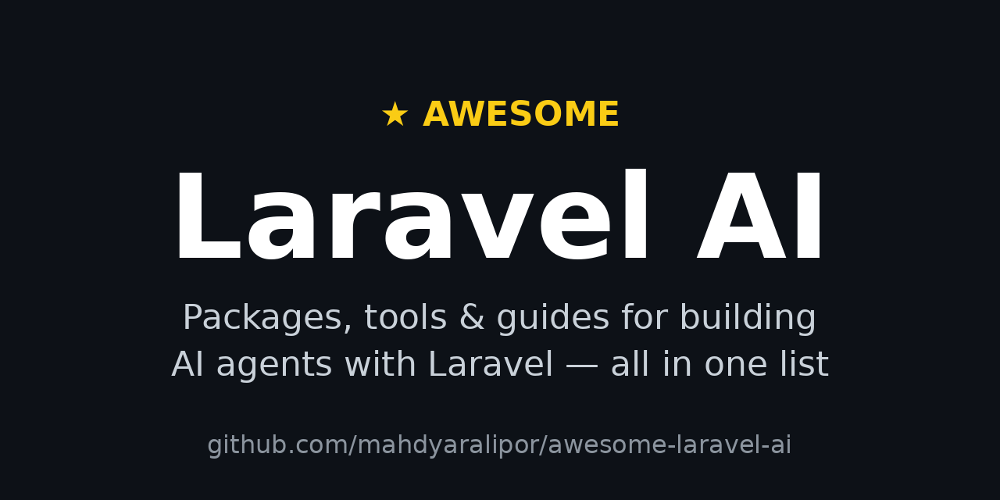

# Awesome Laravel AI 

> Curated packages, tools, tutorials and examples for building AI agents and AI-powered apps with Laravel.

Laravel shipped a first-party AI SDK, an MCP toolkit, official agent skills and a skills directory — and a community ecosystem is growing around them. This list collects the pieces worth knowing, so you don't have to discover them one by one.

## Contents

- [Official](#official)
- [Agent frameworks](#agent-frameworks)
- [RAG and search](#rag-and-search)
- [Providers and clients](#providers-and-clients)
- [MCP servers](#mcp-servers)
- [Evals and observability](#evals-and-observability)
- [Developer tools](#developer-tools)
- [Real-world examples](#real-world-examples)
- [Learning](#learning)

## Official

- [AI SDK documentation](https://laravel.com/docs/13.x/ai-sdk) - Official docs: agents, tools, streaming, testing and deployment.
- [Laravel.com/ai](https://laravel.com/ai) - Product page and overview of Laravel's AI offering.
- [Laravel/agent-skills](https://github.com/laravel/agent-skills) - Official collection of agent skills and plugins for Claude Code and Cursor.
- [Laravel/ai](https://github.com/laravel/ai) - First-party AI SDK: agents, tools, memory, structured output, streaming and vector search across 14 providers.
- [Laravel/boost](https://github.com/laravel/boost) - First-party MCP server plus version-aware guidelines that teach agents your stack.
- [Laravel/mcp](https://github.com/laravel/mcp) - First-party toolkit for building MCP servers inside Laravel apps.
- [skills.laravel.cloud](https://skills.laravel.cloud/) - Open community directory of reusable Laravel and PHP agent skills.

## Agent frameworks

- [laragentic/agents](https://github.com/laragentic/agents) - Agentic loops (ReAct, plan-execute) on top of the official AI SDK, plus example skills.
- [LLPhant/LLPhant](https://github.com/LLPhant/LLPhant) - Generative AI framework for PHP: chat, embeddings, vector stores and tool calling.
- [MaestroError/LarAgent](https://github.com/MaestroError/LarAgent) - AI agent framework for Laravel with RAG, memory and multi-provider support.
- [neuron-core/neuron-ai](https://github.com/neuron-core/neuron-ai) - Agent framework for PHP: connect LLMs, tools, vector databases and memory.

## RAG and search

- [yaojingang/GEOFlow](https://github.com/yaojingang/GEOFlow) - AI content platform on Laravel: RAG pipelines, quality checks and multi-site publishing.
- [LarAIgent/larai-kit](https://github.com/LarAIgent/larai-kit) - Drop-in RAG toolkit: document ingestion, pgvector/Pinecone search and streaming chat.

## Providers and clients

- [modelcontextprotocol/php-sdk](https://github.com/modelcontextprotocol/php-sdk) - Official PHP SDK for building Model Context Protocol servers and clients.
- [mozex/anthropic-php](https://github.com/mozex/anthropic-php) - PHP client for the Anthropic API: messages, streaming, tool use and batches.
- [openai-php/client](https://github.com/openai-php/client) - Community OpenAI client for PHP, used across the ecosystem.
- [openai-php/laravel](https://github.com/openai-php/laravel) - Laravel wrapper around the community OpenAI PHP client.
- [prism-php/prism](https://github.com/prism-php/prism) - Unified interface for working with LLMs in Laravel: providers, tools, structured output and assistants.

## MCP servers

- [BinarCode/laravel-restify](https://github.com/BinarCode/laravel-restify) - API layer for AI agents and humans, with MCP server support.
- [opgginc/laravel-mcp-server](https://github.com/opgginc/laravel-mcp-server) - Secure MCP servers in Laravel over Streamable HTTP and SSE.

## Evals and observability

- [halilcosdu/laravel-slower](https://github.com/halilcosdu/laravel-slower) - Finds slow database queries with AI-powered tips and a dashboard.
- [Nightwatch](https://nightwatch.laravel.com) - Laravel monitoring with an MCP server so agents can browse errors and traces.
- [vizra-ai/vizra-evals](https://github.com/vizra-ai/vizra-evals) - Write agent evals as Pest tests, track scores and cost over time.

## Developer tools

- [hardimpactdev/opencode-sdk-laravel](https://github.com/hardimpactdev/opencode-sdk-laravel) - Use the OpenCode AI coding agent API from Laravel.

## Real-world examples

- [relaticle/relaticle](https://github.com/relaticle/relaticle) - Open-source CRM with native AI agents and MCP tools.

## Learning

- [Building AI Agents with Laravel](https://www.youtube.com/watch?v=vTurdmBklXc) - Talk: how an agency builds AI agents for clients with Laravel and LarAgent.
- [Laravel AI blog](https://laravel.com/blog/category/laravel-ai) - Official posts: benchmarks, multi-agent workflows, evals, MCP apps and production guides.
- [Laravel Launches an Open Directory of AI Agent Skills](https://laravel-news.com/laravel-skills) - Laravel News overview of the skills directory and how to install from it.
- [Leveraging AI for Laravel Development](https://laracasts.com/series/leveraging-ai-for-laravel-development) - Laracasts series: speed up Laravel development with agents, prompting, skills and workflows.
- [So You Want to Build an Agent](https://laracasts.com/series/so-you-want-to-build-an-agent) - Laracasts series: build an AI agent from scratch, prompts, loops, tools and structured output.
- [The Batteries-Included AI Toolkit](https://laracasts.com/series/the-batteries-included-ai-toolkit) - Laracasts series: build AI features with the Laravel AI SDK, chat, memory, tools and retrieval.

## Contributing

Contributions welcome! Please read the [contribution guidelines](CONTRIBUTING.md) first.
